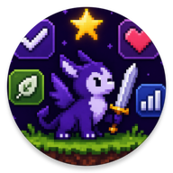
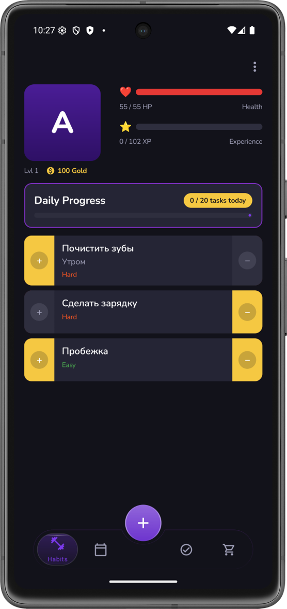
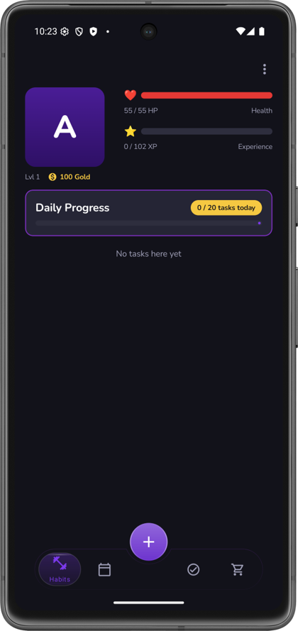
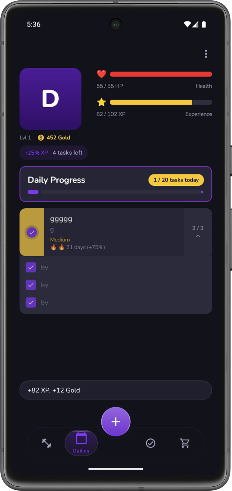
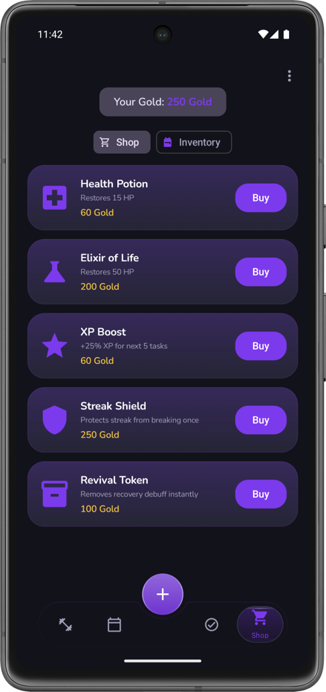
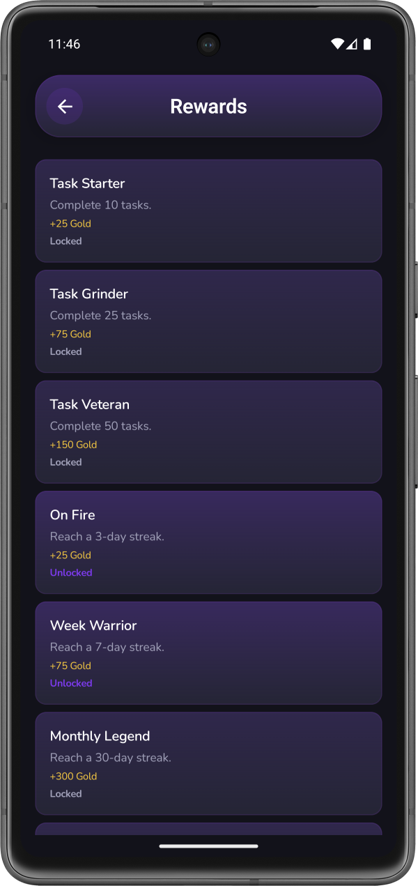
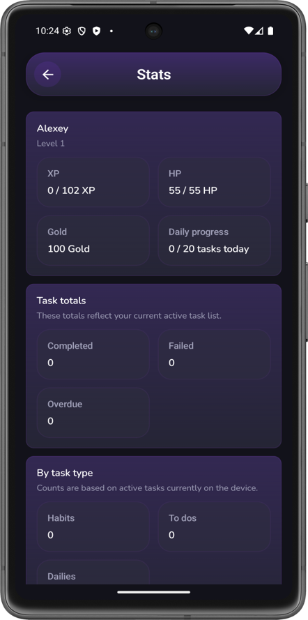
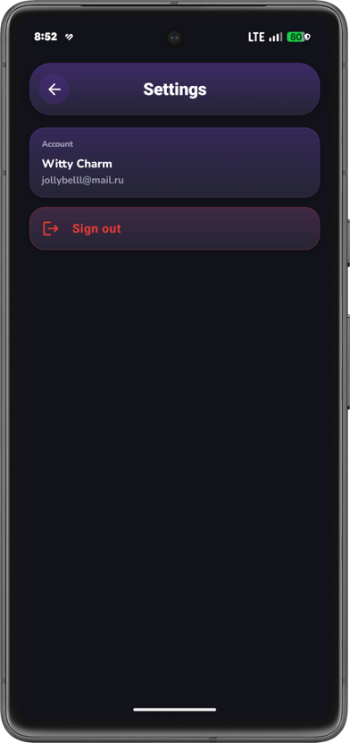
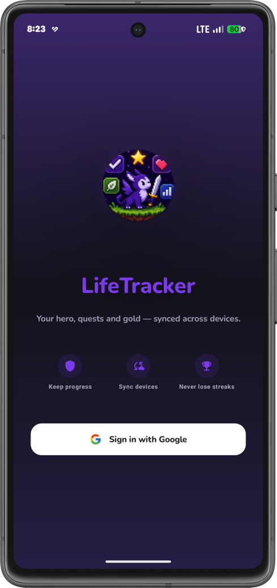

<div align="center">



# ⚔️ LifeTracker

### Turn your daily habits into an RPG adventure


<br/>

*Complete real-life tasks. Level up your hero. Don't let your HP hit zero.*

</div>

---

## 📖 About

**LifeTracker** is a full-stack gamified habit tracker that transforms your daily productivity into an RPG experience. Create a hero, complete real-life tasks to earn **XP** and **gold**, level up, manage your **HP**, buy items from the shop, and unlock achievements. Miss tasks? Your hero takes damage. Let your HP hit zero? **Your hero dies** — and you lose progress.

The app makes self-improvement feel like playing a game.

---

## 📱 Screenshots

<table>
  <tr>
    <td align="center"><b>🏠 Home Screen</b></td>
    <td align="center"><b>⚔️ Hero Stats</b></td>
  </tr>
  <tr>
    <td align="center"></td>
    <td align="center"></td>
  </tr>
  <tr>
    <td align="center"><b>📋 Tasks</b></td>
    <td align="center"><b>🛒 Shop</b></td>
  </tr>
  <tr>
    <td align="center"></td>
    <td align="center"></td>
  </tr>
  <tr>
    <td align="center"><b>🏆 Achievements</b></td>
    <td align="center"><b>📊 Statistics</b></td>
  </tr>
  <tr>
    <td align="center"></td>
    <td align="center"></td>
  </tr>
  <tr>
    <td align="center"><b>⚙️ Settings</b></td>
    <td align="center"><b>🔐 Sign In</b></td>
  </tr>
  <tr>
    <td align="center"></td>
    <td align="center"></td>
  </tr>
</table>

---

## 🎮 Features

### 🦸 Hero System
- Create and name your hero
- **Level up** from 1 to 999 with a progressive XP curve: `BaseXp × level^1.8 × (1 + level/50)`
- HP scales with level: `50 + 5 × level`
- Earn **gold** to spend in the shop

### 📝 Task System
| Type | Description |
|------|-------------|
| **🎯 Habit** | Repeatable tasks with streak tracking |
| **✅ One-Time** | Single-completion tasks with due dates |
| **📅 Daily** | Tasks with a daily schedule and auto-reset |

Each task has **4 difficulty tiers** (Easy → Medium → Hard → Epic), rewarding more XP, gold, and carrying higher HP penalties.

### 🔥 Streak System
- **Streak multiplier**: `1.0 + log₂(streakDays + 1) × 0.15` — longer streaks = more rewards
- **Freeze charges** (up to 3) to protect a streak for one day
- **Streak Shields** — purchasable protection from one streak break
- **Break penalties** scale with streak length (XP/gold loss + cooldown)

### 💰 Economy & Shop

| Item | Price | Effect |
|------|-------|--------|
| ❤️ Health Potion | 60 gold | Restores 15 HP |
| 💚 Elixir of Life | 200 gold | Restores 50 HP |
| ⚡ XP Boost | 60 gold | +25% XP for next 5 tasks |
| 🛡️ Streak Shield | 250 gold | Protects streak from one break |
| 🔄 Revival Token | 100 gold | Removes recovery debuff instantly |

- Daily task cap of **20 completions** per day
- XP/Gold multipliers with expiry timers

### 💀 Death & Recovery
- If HP reaches **0**, your hero **dies** with severe penalties:
  - **-10% XP**, **-20% Gold**, **-50% Streak progress**
  - HP resets to 25% of max
- **Recovery debuff** for 4 hours after respawn (0.75× multiplier on all rewards)

### 🏆 Achievement System
- Unlock achievements by completing milestones
- Earn bonus **gold** rewards
- Dedicated achievements screen with progress tracking

### 🔐 Authentication
- **Google OAuth** sign-in (one-tap on Android)
- **JWT Access + Refresh Tokens** with automatic rotation
- Device-scoped authorization
- Encrypted token storage on-device

---

## 🏗️ Architecture

The project follows **Clean Architecture** with clear separation of concerns:

```
┌─────────────────────────────────────────────────────────┐
│                    📱 MOBILE (Android)                   │
├─────────────────────────────────────────────────────────┤
│                                                         │
│   ┌─────────┐   ┌─────────┐   ┌─────────┐             │
│   │   UI    │──▶│ Domain  │◀──│  Data   │             │
│   │ Screens │   │ Models  │   │ Room DB │             │
│   │   VMs   │   │UseCases │   │ Retrofit│             │
│   │  Theme  │   │  Repos  │   │  DTOs   │             │
│   └─────────┘   └─────────┘   └─────────┘             │
│        │             │              │                   │
│        └───── DI: Koin ──────┘─────┘                   │
│                                                         │
├─────────────────────────────────────────────────────────┤
│               🌐 BACKEND (.NET 8.0)                    │
├─────────────────────────────────────────────────────────┤
│                                                         │
│   ┌──────────┐   ┌──────────┐   ┌──────────┐          │
│   │Controllers│──▶│ Services │──▶│  Models  │          │
│   │  REST API │   │GameEngine│   │ EF Core  │          │
│   │  Swagger  │   │  Auth    │   │PostgreSQL│          │
│   └──────────┘   └──────────┘   └──────────┘          │
│                                                         │
└─────────────────────────────────────────────────────────┘
```

---

## 🛠️ Tech Stack

### 📱 Mobile

| Category | Technology |
|----------|------------|
| **Language** | Kotlin |
| **UI** | Jetpack Compose + Material 3 |
| **DI** | Koin (Android, Compose, WorkManager) |
| **Local DB** | Room |
| **Networking** | Retrofit + OkHttp |
| **Auth** | Google Sign-In + AndroidX Credentials |
| **Secure Storage** | AndroidX Security Crypto |
| **Background** | WorkManager |
| **Navigation** | Compose Navigation |
| **Fonts** | Google Fonts |

### 🌐 Backend

| Category | Technology |
|----------|------------|
| **Framework** | ASP.NET Core 8.0 (Web API) |
| **Language** | C# |
| **Database** | PostgreSQL |
| **ORM** | Entity Framework Core 8.0 |
| **Auth** | JWT Bearer + Google OAuth |
| **API Docs** | Swagger / Swashbuckle |
| **Timezone** | TimeZoneConverter |

### 🐳 DevOps

| Category | Technology |
|----------|------------|
| **Containerization** | Docker (multi-stage build) |
| **Hosting** | Railway |

---

## 📁 Project Structure

```
LifeTrackerFullStack/
│
├── LifeTrackerMobile/              # 📱 Android App
│   └── app/src/main/java/com/lifetracker/mobile/
│       ├── ui/                     # Screens, ViewModels, Components, Theme
│       │   ├── screens/            # 9 screens (Home, Shop, Stats, ...)
│       │   ├── viewmodel/          # 7 ViewModels
│       │   └── components/         # Reusable UI components
│       ├── domain/                 # Business logic layer
│       │   ├── model/              # 19 domain models
│       │   ├── repository/         # Repository interfaces
│       │   └── usecase/            # Use cases
│       ├── data/                   # Data layer
│       │   ├── local/              # Room DB (DAOs, Entities)
│       │   ├── remote/             # Retrofit API + DTOs
│       │   └── repository/         # Repository implementations
│       ├── core/                   # Cross-cutting concerns
│       │   ├── network/            # Network utilities
│       │   ├── reminder/           # Notification system
│       │   ├── sync/               # Data synchronization
│       │   └── theme/              # Theme utilities
│       ├── di/                     # Koin DI modules
│       └── navigation/             # Compose Navigation graph
│
├── LifeTrackerBackend/             # 🌐 ASP.NET Core API
│   ├── Controllers/                # REST endpoints (Auth, Hero, Task, Shop)
│   ├── Services/                   # Business logic
│   │   ├── GameEngineService.cs    # Core game mechanics
│   │   ├── ShopService.cs          # Shop & purchases
│   │   ├── Achievements/           # Achievement system
│   │   ├── Auth/                   # JWT + Google OAuth
│   │   └── Time/                   # Timezone-aware scheduling
│   ├── Models/                     # EF Core entities (10 models)
│   ├── Data/                       # DbContext
│   ├── Constants/                  # Game constants & formulas
│   ├── Configuration/              # App config & auth options
│   ├── Filters/                    # Request filters (device ID)
│   ├── Migrations/                 # EF Core migrations
│   └── Dockerfile                  # Multi-stage Docker build
│
└── LifeTrackerBackend.Tests/       # 🧪 20 Test Files
    ├── GameEngineServiceTests.cs
    ├── AchievementServiceTests.cs
    ├── ShopServiceTests.cs
    ├── AuthControllerTests.cs
    ├── StreakTests.cs
    └── ... (15 more)
```

---

## 🚀 Getting Started

### Prerequisites

- **.NET 8.0 SDK** — [Download](https://dotnet.microsoft.com/download/dotnet/8.0)
- **PostgreSQL** — [Download](https://www.postgresql.org/download/)
- **Android Studio** (with Kotlin & Compose support)
- **Google Cloud** project with OAuth credentials (for sign-in)

### 🌐 Backend Setup

```bash
# Clone the repository
git clone https://github.com/Witty-Charm/LifeTrackerFullStack.git
cd LifeTrackerFullStack/LifeTrackerBackend

# Configure connection string in appsettings.json
# Update "DefaultConnection" with your PostgreSQL credentials

# Run database migrations
dotnet ef database update

# Start the API
dotnet run
```

The API will be available at `https://localhost:5001` with Swagger docs at `/swagger`.

### 📱 Mobile Setup

```bash
# Open LifeTrackerMobile/ in Android Studio

# Update the API base URL in your network config:
#   - Debug:    http://10.0.2.2:5000/ (emulator)
#   - Release:  https://lifetrackerfullstack-production.up.railway.app/

# Build and run on an emulator or device
```

### 🐳 Docker

```bash
# From the root directory
cd LifeTrackerBackend
docker build -t lifetracker-api .
docker run -p 5000:8080 \
  -e ConnectionStrings__DefaultConnection="Host=...;Database=..." \
  lifetracker-api
```

---

## 🧪 Testing

The backend includes **20 comprehensive test files** covering:

| Area | What's Tested |
|------|---------------|
| 🔐 **Auth** | Google sign-in, JWT generation, token validation, user creation |
| ⚔️ **Game Engine** | XP calculation, leveling, damage, HP management |
| 🔥 **Streaks** | Streak counting, freeze, shield, break penalties |
| 🛒 **Shop** | Purchases, inventory, item effects |
| 🏆 **Achievements** | Unlock criteria, rewards, milestone tracking |
| 📅 **Daily Schedules** | Schedule creation, reset, timezone handling |
| 🎯 **Habits** | Effective counters, reset logic, polarity |
| 👤 **Ownership** | User isolation, device-scoped access |

```bash
# Run all tests
cd LifeTrackerBackend
dotnet test
```

---

## 📊 Game Mechanics at a Glance

```
Task Completed ──▶ Gain XP + Gold ──▶ Level Up ──▶ 🎉
      │                                      │
      │              Streak +1               │
      │         Multiplier increases         │
      │                                      ▼
      │                              New abilities,
      │                              more HP, more gold
      │
      ▼
Task Missed ──▶ HP Damage ──▶ Streak Reset ──▶ 😰
                     │
                     ▼
              HP hits 0 ──▶ 💀 HERO DIES
                                │
                         Lose XP, Gold, Streak
                         Recovery debuff (4h)
```

---

## 📄 License

This project does not currently have a license. Contact the author for usage terms.

---

<div align="center">

**Made with ❤️ and a lot of ⚔️ by [Witty-Charm](https://github.com/Witty-Charm)**

*If this project helped you, consider giving it a ⭐!*

</div>
